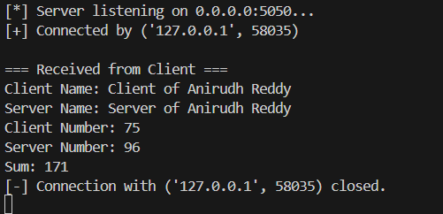
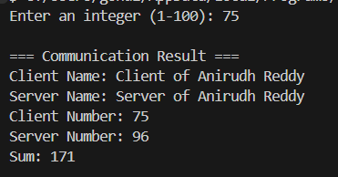

# CN Lab Assignment 1: Socket Programming

## 📌 Objective
Implement a **TCP-based client-server application** where:
- The **client** sends its name and a number (1–100) to the server.
- The **server** responds with its name and another number (1–100).
- Both client and server display exchanged values and their **sum**.

---

## 🖥️ Features
- TCP socket communication over a custom port (>5000).
- Supports **cross-machine communication** (just change IP).
- **Threaded server** for handling multiple clients simultaneously.
- Proper socket closing to avoid port binding issues.
- Simple, easy-to-read Python implementation.

---

## 🔧 Requirements
- Python 3.x
- Runs on **Windows**, **Linux**, or **MacOS** without changes.

---

## 📂 File Structure
```
CN-Lab-Socket-Programming/
│
├── client.py         # Client-side script
├── server.py         # Server-side script
├── screenshots/      # Folder to store output screenshots
│   ├── server.png
│   └── client.png
└── README.md         # Project documentation
```

---

## 🚀 How to Run

### 1. Start the Server
```bash
python3 server.py
```
The server will listen on `0.0.0.0:5050`.

---

### 2. Start the Client
```bash
python3 client.py
```
Enter a number between **1 and 100** when prompted.

---

## 📸 Output

### 🖥️ Server Output


---

### 💻 Client Output



## 🌐 Running on Different Machines
1. Find the server's IP:
   - Windows: `ipconfig`
   - Linux/Mac: `ifconfig`
2. Replace `HOST = "127.0.0.1"` in `client.py` with that IP.
3. Run the server on one machine, client on another.

---

## 🧩 Notes
- The server **terminates** if it receives a number outside `1–100`.
- Uses **threading** to support multiple clients concurrently.
- Always close sockets to prevent port reuse issues.

---

## 📝 Authors
- **Anirudh Reddy**
- CN Lab (MA3105) Assignment 1
